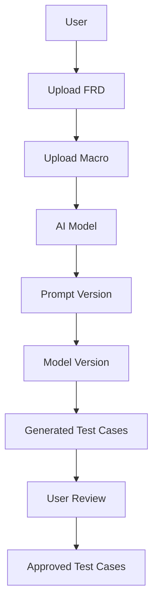
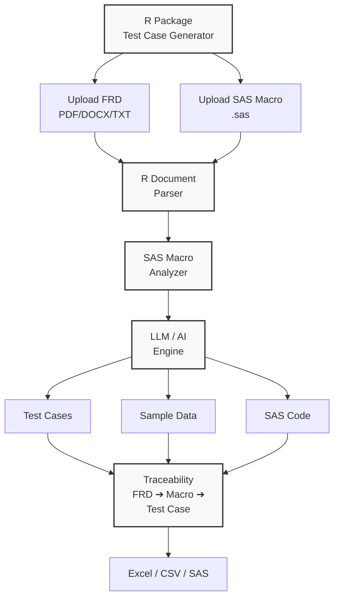
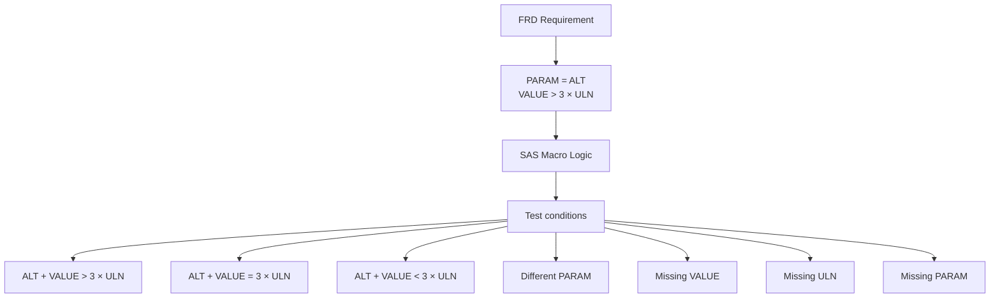
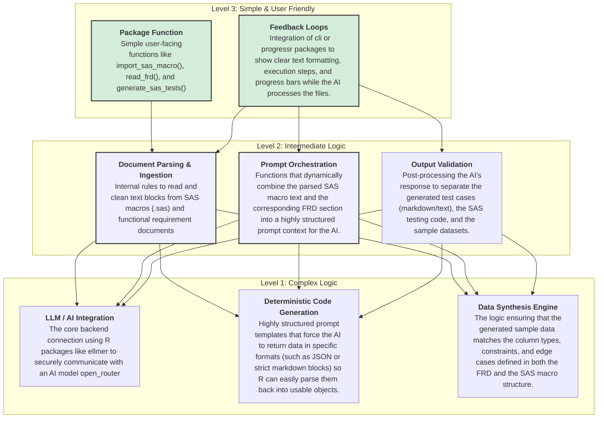

*I would like to create a R package which allow the importing the sas macro code and functional requirements documents and based on frd andacro.code block it should generate the test cases and along with sas code with sample data. All should happen in R only. THis should be simple R package that can read SAS macro code and functional requirements documents (FRD), and then generate test cases along with SAS code and sample data. Below is a simple outline of how you can structure your R package to achieve this functionality

## Feature architecture:


## Full Architecture



##  System Prompt for ellmer:
You are a Senior SAS Programmer and Clinical Programming
Validation Expert.

Analyze the Functional Requirements Document and SAS Macro.

Your objective is to generate comprehensive test cases that
validate whether the SAS macro satisfies the functional
requirements.

Analyze:

1. Functional requirements
2. Macro parameters
3. Macro variables
4. DATA step logic
5. IF/ELSE conditions
6. WHERE conditions
7. PROC SQL logic
8. SAS functions
9. Loops
10. %IF/%ELSE
11. %DO loops
12. Dynamic code generation
13. Dataset inputs/outputs
14. Variable creation
15. Variable modification
16. Missing values
17. Boundary conditions
18. Invalid inputs
19. Duplicate records
20. Data type issues

For every requirement generate:

- Requirement ID
- Test Case ID
- Test Scenario
- Test Objective
- Input Variables
- Input Values
- Expected Output
- Expected Result
- Test Type
- SAS Test Code
- Traceability

Test types should include:

POSITIVE
NEGATIVE
BOUNDARY
MISSING VALUE
DATA TYPE
DUPLICATE
PARAMETER
ERROR HANDLING

Return the result as structured JSON.

## Example

### FRD

If parameter is ALT and value is greater than 3 × ULN, derive toxicity flag = Y.
### SAS macro
```sas
%macro derive_flag(
    input=,
    output=
);

data &output;
    set &input;

    if PARAM = "ALT" and VALUE > 3*ULN then
        TOXFL = "Y";
    else
        TOXFL = "N";

run;

%mend;
```
### Logic
R package automatically identifies:

### Test cases
Then it shuold generate the following test cases:

| ID    | Type     | Scenario           | Expected |
| ----- | -------- | ------------------ | -------- |
| TC001 | Positive | ALT > 3×ULN        | Y        |
| TC002 | Boundary | ALT = 3×ULN        | N        |
| TC003 | Negative | ALT < 3×ULN        | N        |
| TC004 | Negative | AST instead of ALT | N        |
| TC005 | Missing  | VALUE missing      | N        |
| TC006 | Missing  | ULN missing        | N        |
### SAS test data
And generate SAS test data:
```sas
data test_input;
    input USUBJID $ PARAM $ VALUE ULN;
datalines;
SUBJ001 ALT 350 100
SUBJ002 ALT 300 100
SUBJ003 ALT 250 100
SUBJ004 AST 350 100
SUBJ005 ALT .   100
;
run;
```
### Validation code
Then generate validation code:
```sas  
%derive_trtemfl(
    in=test_input,
    out=test_output
);

proc print data=test_output;
run;
```
## constraints
1. This is poc with less efforts, no test cases please and with minimum code.
2. Use skills like [cli](C:\\Users\\admin\\.codex\\skills\\cli\\SKILL.md), [tidy-r](C:\\Users\\admin\\.agents\\skills\\tidy-r\\SKILL.md),  [r-package-development](C:\\Users\\admin\\.codex\\skills\\r-package-development\\SKILL.md) and functional programming and good coding practices. 
3. The R package should be able to read and parse SAS macro code and functional requirements documents
4. Just focus on generating test cases and SAS code with sample data based on the FRD and SAS macro code. 
5. The package should be simple and user-friendly, allowing users to easily upload their FRD and SAS macro code, and receive the generated test cases and SAS code with sample data in a structured format.
# Coding Architecture structure:


This is a high-level architecture for your R package that will allow users to upload SAS macro code and functional requirements documents, and then generate test cases along with SAS code and sample data. The package will be structured in a way that is user-friendly, while also incorporating complex logic for parsing, analyzing, and generating the required outputs.*